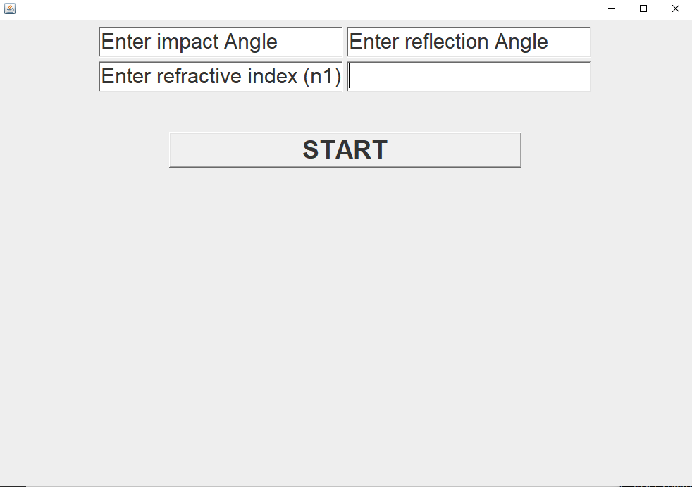
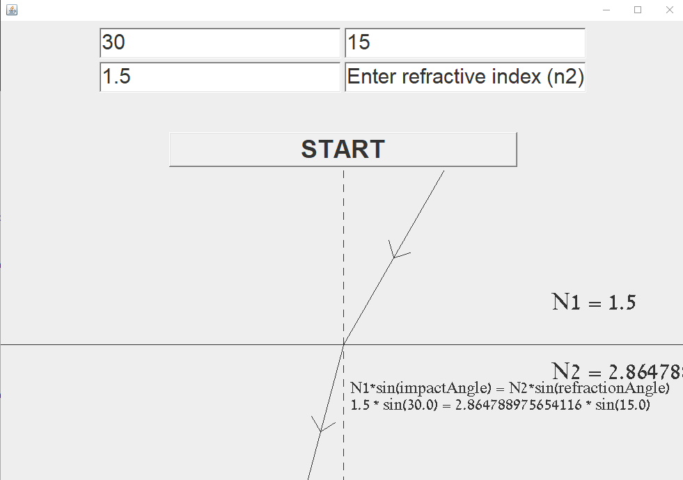

# Physics project - Snel's law

This project calculates and represents Snel's law in optical physics
```bash
n1 * impactAngle = n2 * refractionAngle
```

## Installation

to use the program you would need to download the jdk from the oracle website, download this project and copy every file under the src folder to your jdk_folder/bin 

## Usage
In order to use the program you need to open cmd(windowsKey than type cmd and press enter) and run the following lines

```bash
cd path_to_your_jdk/bin
javac Main.java
java Main.java
```
If you've completed the steps correctly you'll see this interactive window


From here you can enter your values in the text boxes, don't worry if you make a mistake the program will tell you when you try to start.

After you added three or more inputs you can run the program and it'll tell you the answer and draw a picture with all the details as shown in this picture


## Contributing
Pull requests are welcome. For major changes, please open an issue first to discuss what you would like to change.

Please make sure to update tests as appropriate.

## License
[MIT](https://choosealicense.com/licenses/mit/)
